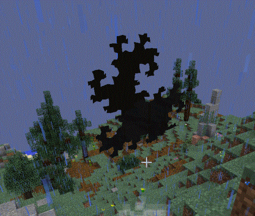

如果你遇到一个看起来像额外图像的对象，你就遇到了一个来自维度门的裂痕。这些裂口的规模在扩大，但在其他方面是无害的。它们充当一个地点和另一个地点之间的纽带。它们随机出现在世界生成中，或者当一个维度门被打破时。当你进入一个次元门地牢时，它也会取代大门。这个裂痕仍然会通向地牢，并且可以通过放置一个木制的维度门来再次进入地牢。

处理裂痕有三种方法：一种是使用裂痕去除剂，它将永远摧毁裂痕。第二种方法是在上面放置一个木制的立体门。这将使木制次元门链接到裂缝所连接的地方。如果没有链接位置，当您尝试使用它时，门会告诉您。第三种方法是在裂痕上使用裂痕稳定器。这将阻止裂痕的扩大。
