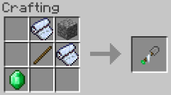

建造一个Yurt, Tepee, Bedouin, Indlu, 或者 (新) Shamiyana。

设置好，取下它，再也不用担心离家太远了。

在JEI中输入@nomadictents可查看此mod中的所有物品。

帐篷有各种尺寸：从小型（5x5）、中型（7x7）和大型（9x9）到大型（11x11）、巨型（13x13）和巨型（15x15）。以下是如何开始：
___

# 第一步: 制作帐篷

到目前位置，你的帐篷有五种选择: Yurt, Tepee, Bedouin, Indlu, 和 Shamiyana。
___
# 第二步: 升级帐篷
尺寸升级：帐篷的大小可以通过合成制作来升级。

深度升级：这些可以让你增加帐篷下面的泥土层。最后，你可以拥有你一直想要的证明监狱——我是说，水果地窖！

更大的帐篷可以升级到5倍，但你至少需要一个中等大小的帐篷来开始。添加下一层深度需要下一层帐篷铲-石头帐篷铲用于第1层深度，铁帐篷铲用于第2层深度，黄金、黑曜石和钻石帐篷铲也以此类推。

使用这些是轻而易举的！把帐篷放在一个工作台的格子中间，下面是帐篷铲，两边是泥土，顶部是一块相应的材料。

小贴士：按住SHIFT，同时查看背包中的帐篷，看看它可以升级多少次。小帐篷是0，中型帐篷是1，以此类推，直到大帐篷，是5。
___
# 第三步: 建造帐篷
先做个帐篷槌。帐篷是不会自己从天上掉下来的！

使用帐篷物品将在您选择的位置以帐篷形状放置框架块。然后用帐篷槌敲打每一块。这将需要几分钟的现实时间，所以不要等到夜幕降临才开始！

超级帐篷槌可以只需一次点击就做成帐篷！它可能是一个创造性模式的项目，取决于配置。
___
# 第四步: 享受帐篷!
当你完成搭建帐篷，走进门或者点击门进入（最好是空手）。

这是什么？我搭帐篷的时候是5x5，但里面要大得多！

这就是游牧帐篷的神奇之处：帐篷的外部尺寸可以相同（搭起来所需的时间相同），但内部可以豪华宽敞！如果你升级它的话。
___
# 第五步: 移动帐篷
一座房子卡在一个地方有多大用处？不是很有用，这就是为什么游牧帐篷存在！

只需在门上使用帐篷槌来解构你的帐篷。然后把它放置在别的地方，一切都会在里面。
